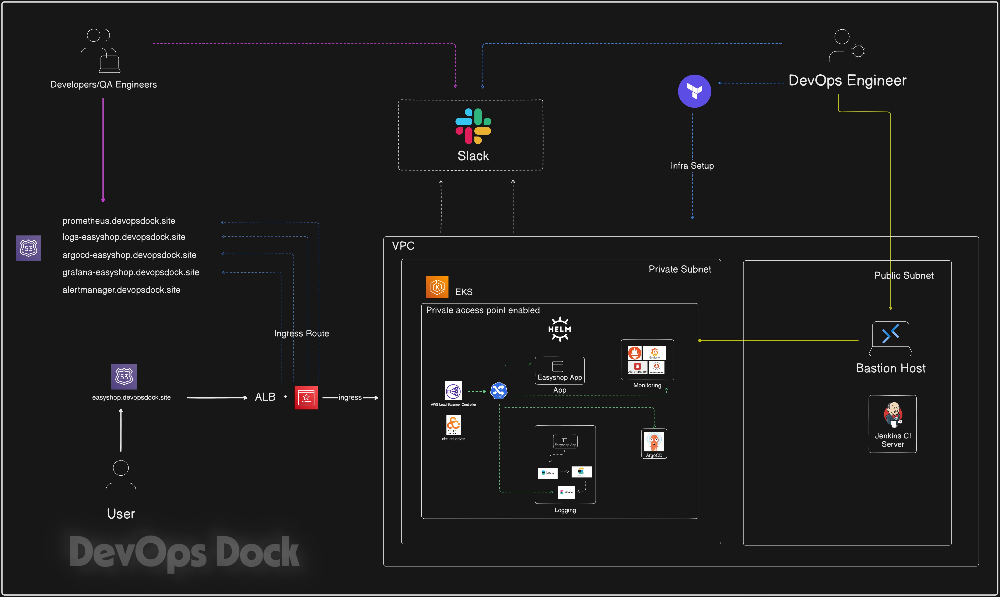
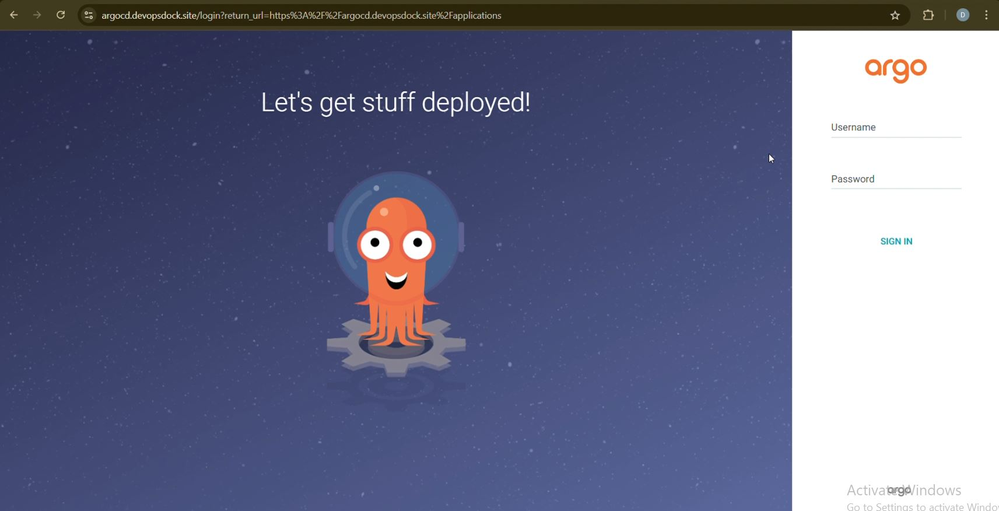
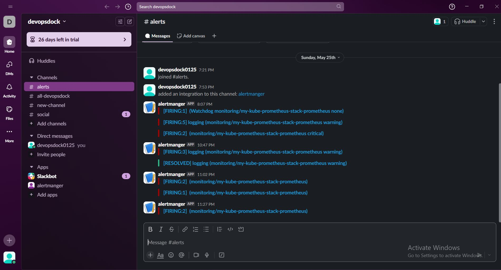
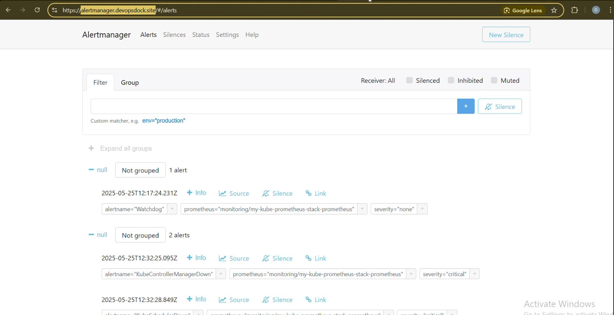
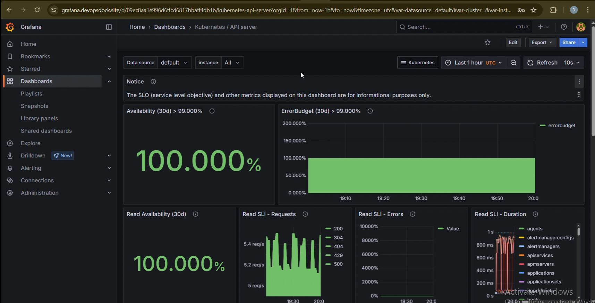
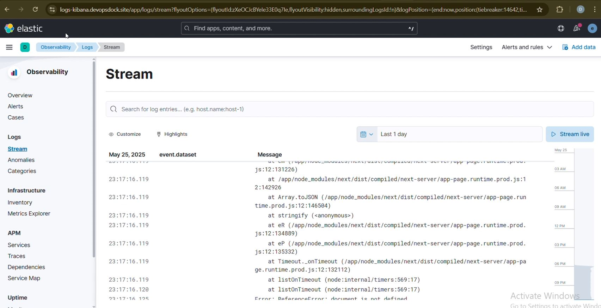
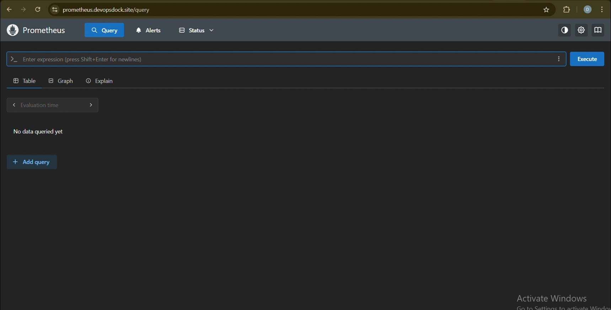

# 🛍️ EasyShop - Modern E-commerce Platform

[](https://nextjs.org/)
[](https://www.typescriptlang.org/)
[](https://www.mongodb.com/)
[](https://redux.js.org/)
[](LICENSE)

EasyShop is a modern, full-stack e-commerce platform built with Next.js 14, TypeScript, and MongoDB. It features a beautiful UI with Tailwind CSS, secure authentication, real-time cart updates, and a seamless shopping experience.

## ✨ Features

- 🎨 Modern and responsive UI with dark mode support
- 🔐 Secure JWT-based authentication
- 🛒 Real-time cart management with Redux
- 📱 Mobile-first design approach
- 🔍 Advanced product search and filtering
- 💳 Secure checkout process
- 📦 Multiple product categories
- 👤 User profiles and order history
- 🌙 Dark/Light theme support

## 🏗️ Architecture

EasyShop follows a three-tier architecture pattern:

### 1. Presentation Tier (Frontend)
- Next.js React Components
- Redux for State Management
- Tailwind CSS for Styling
- Client-side Routing
- Responsive UI Components

### 2. Application Tier (Backend)
- Next.js API Routes
- Business Logic
- Authentication & Authorization
- Request Validation
- Error Handling
- Data Processing

### 3. Data Tier (Database)
- MongoDB Database
- Mongoose ODM
- Data Models
- CRUD Operations
- Data Validation

## PreRequisites

> [!IMPORTANT]  
> Before you begin setting up this project, make sure the following tools are installed and configured properly on your system:

## Setup & Initialization <br/>

### 1. Install Terraform
* Install Terraform<br/>
#### Linux & macOS
```bash
curl -fsSL https://apt.releases.hashicorp.com/gpg | sudo apt-key add -
sudo apt-add-repository "deb [arch=amd64] https://apt.releases.hashicorp.com $(lsb_release -cs) main"
sudo apt-get update && sudo apt-get install terraform
```
### Verify Installation
```bash
terraform -v
```
### Initialize Terraform
```bash
terraform init
```
### 2. Install AWS CLI
AWS CLI (Command Line Interface) allows you to interact with AWS services directly from the command line.

```bash
curl "https://awscli.amazonaws.com/awscli-exe-linux-x86_64.zip" -o "awscliv2.zip"
sudo apt install unzip
unzip awscliv2.zip
sudo ./aws/install
```
###  Install AWS CLI in Windows 'powershell'
```msiexec.exe /i https://awscli.amazonaws.com/AWSCLIV2.msi```


 ```aws configure```


> #### This will prompt you to enter:<br/>
- **AWS Access Key ID:**<br/>
- **AWS Secret Access Key:**<br/>
- **Default region name:**<br/>
- **Default output format:**<br/>

> [!NOTE] 
> Make sure the IAM user you're using has the necessary permissions. You’ll need an AWS IAM Role with programmatic access enabled, along with the Access Key and Secret Key.

## Getting Started

> Follow the steps below to get your infrastructure up and running using Terraform:<br/>

1. **Clone the Repository:**
First, clone this repo to your local machine:<br/>
```bash
git clone https://github.com/LondheShubham153/tws-e-commerce-app.git
cd terraform
```
2. **Generate SSH Key Pair:**
Create a new SSH key to access your EC2 instance:
```bash
ssh-keygen -f terra-key
```
This will prompt you to create a new key file named terra-key.

3. **Private key permission:** Change your private key permission:
```bash
chmod 400 terra-key
```

4. **Initialize Terraform:**
Initialize the Terraform working directory to download required providers:
```bash
terraform init
```
5. **Review the Execution Plan:**
Before applying changes, always check the execution plan:
```bash
terraform plan
```
6. **Apply the Configuration:**
Now, apply the changes and create the infrastructure:
```bash
terraform apply
```
> Confirm with `yes` when prompted.

7. **Access Your EC2 Instance;** <br/>
After deployment, grab the public IP of your EC2 instance from the output or AWS Console, then connect using SSH:
```bash
ssh -i terra-key ubuntu@<public-ip>
```
8. **Update your kubeconfig:**
wherever you want to access your eks wheather it is yur local machine or bastion server this command will help you to interact with your eks.
> [!CAUTION]
> you need to configure aws cli first to execute this command:

```bash
aws configure
```

```bash
aws eks --region eu-west-1 update-kubeconfig --name tws-eks-cluster
```
9. **Check your cluster:**
```bash
kubectl get nodes
```

## Jenkins Setup Steps
> [!TIP]
> Check if jenkins service is running:

```bash
sudo systemctl status jenkins
```
## Steps to Access Jenkins & Install Plugins

#### 1. **Open Jenkins in Browser:**
> Use your public IP with port 8080:
>**http://<public_IP>:8080**

#### 2. **Initial Admin password:**
> Start the service and get the Jenkins initial admin password:
> ```bash
> sudo cat /var/lib/jenkins/secrets/initialAdminPassword
> ```

#### 3. **Start Jenkins (*If Not Running*):**
> Get the Jenkins initial admin password:
> ```bash
> sudo systemctl enable jenkins
> sudo systemctl restart jenkins
> ```
#### 4. **Install Essential Plugins:**
> - Navigate to:
> **Manage Jenkins → Plugins → Available Plugins**<br/>
> - Search and install the following:<br/>
>   - **Docker Pipeline**<br/>
>   - **Pipeline View**


#### 5. **Set Up Docker & GitHub Credentials in Jenkins (Global Credentials)**<br/>
>
> - GitHub Credentials:
>   - Go to:
**Jenkins → Manage Jenkins → Credentials → (Global) → Add Credentials**
> - Use:
>   - Kind: **Username with password**
>   - ID: **github-credentials**<br/>


> - DockerHub Credentials:
> Go to the same Global Credentials section
> - Use:
>   - Kind: **Username with password**
>   - ID: **docker-hub-credentials**
> [Notes:]
> Use these IDs in your Jenkins pipeline for secure access to GitHub and DockerHub

#### 6. Jenkins Shared Library Setup:
> - `Configure Trusted Pipeline Library`:
>   - Go to:
> **Jenkins → Manage Jenkins → Configure System**
> Scroll to Global Pipeline Libraries section
>
> - **Add a New Shared Library:** 
> - **Name:** Shared
> - **Default Version:** main
> - **Project Repository URL:** `https://github.com/<your user-name/jenkins-shared-libraries`.
>
> [Notes:] 
> Make sure the repo contains a proper directory structure eq: vars/<br/>
	
#### 7. Setup Pipeline<br/>
> - Create New Pipeline Job<br/>
>   - **Name:** EasyShop<br/>
>   - **Type:** Pipeline<br/>
> Press `Okey`<br/>

> > In **General**<br/>
> > - **Description:** EasyShop<br/>
> > - **Check the box:** `GitHub project`<br/>
> > - **GitHub Repo URL:** `https://github.com/<your user-name/tws-e-commerce-app`<br/>
>
> > In **Trigger**<br/>
> > - **Check the box:**`GitHub hook trigger for GITScm polling`<br/>
>
> > In **Pipeline**<br/>
> > - **Definition:** `Pipeline script from SCM`<br/>
> > - **SCM:** `Git`<br/>
> > - **Repository URL:** `https://github.com/<your user-name/tws-e-commerce-app`<br/>
> > - **Credentials:** `github-credentials`<br/>
> > - **Branch:** master<br/>
> > - **Script Path:** `Jenkinsfile`<br/>

#### **Fork Required Repos**<br/>
> > Fork App Repo:<br/>
> > * Open the `Jenkinsfile`<br/>
> > * Change the DockerHub username to yours<br/>
>
> > **Fork Shared Library Repo:**<br/>
> > * Edit `vars/update_k8s_manifest.groovy`<br/>
> > * Update with your `DockerHub username`<br/>
> 
> > **Setup Webhook**<br/>
> > In GitHub:<br/>
> >  * Go to **`Settings` → `Webhooks`**<br/>
> >  * Add a new webhook pointing to your Jenkins URL<br/>
> >  * Select: **`GitHub hook trigger for GITScm polling`** in Jenkins job<br/>
>
> > **Trigger the Pipeline**<br/>
> > Click **`Build Now`** in Jenkins

#### **8. CD – Continuous Deployment Setup**<br/>
**Prerequisites:**<br/>
Before configuring CD, make sure the following tools are installed:<br/>
* Installations Required:<br/>
**kubectl**<br/>
**AWS CLI**

**SSH into Bastion Server**<br/>
* Connect to your Bastion EC2 instance via SSH.

**Note:**<br/>
This is not the node where Jenkins is running. This is the intermediate EC2 (Bastion Host) used for accessing private resources like your EKS cluster.

**8. Configure AWS CLI on Bastion Server**
Run the AWS configure command:<br/>
```bash
aws configure
```
Add your Access Key and Secret Key when prompted.

**9. Update Kubeconfig for EKS**<br/>
Run the following important command:
```bash
aws eks update-kubeconfig --region eu-west-1 --name tws-eks-cluster
```
* This command maps your EKS cluster with your Bastion server.
* It helps to communicate with EKS components.

**10. Install AWS application load balancer refering the below docs link**<br/>
```
https://docs.aws.amazon.com/eks/latest/userguide/lbc-helm.html
```
**11. Install the EBS CSI driver refering the below docs link**<br/>
```
https://docs.aws.amazon.com/eks/latest/userguide/ebs-csi.html#eksctl_store_app_data
```


**12. Argo CD Setup**<br/>
Create a Namespace for Argo CD<br/>
```bash
kubectl create namespace argocd
```
1. Install Argo CD using helm  
(https://artifacthub.io/packages/helm/argo/argo-cd)
```bash
helm repo add argo https://argoproj.github.io/argo-helm
helm install my-argo-cd argo/argo-cd --version 8.0.10
```
2. get the values file and save it
```bash
helm show values argo/argo-cd > argocd-values.yaml
```
3. edit the values file, change the below settings.
```
global:
  domain: argocd.example.com

configs:
  params:
    server.insecure: true

server:
  ingress:
    enabled: true
    controller: aws
    ingressClassName: alb
    annotations:
      alb.ingress.kubernetes.io/scheme: internet-facing
      alb.ingress.kubernetes.io/certificate-arn: <your-cert-arn>
      alb.ingress.kubernetes.io/group.name: easyshop-app-lb
      alb.ingress.kubernetes.io/target-type: ip
      alb.ingress.kubernetes.io/backend-protocol: HTTP
      alb.ingress.kubernetes.io/listen-ports: '[{"HTTP":80}, {"HTTPS":443}]'
      alb.ingress.kubernetes.io/ssl-redirect: '443'
    hostname: argocd.devopsdock.site
    aws:
      serviceType: ClusterIP # <- Used with target-type: ip
      backendProtocolVersion: GRPC
```
4. save and upgrade the helm chart.
```
helm upgrade my-argo-cd argo/argo-cd -n argocd -f my-values.yaml
```
5. add the record in route53 “argocd.devopsdock.site” with load balancer dns.

6. access it in browser.

7. Retrive the secret for Argocd

```jsx
kubectl -n argocd get secret argocd-initial-admin-secret -o jsonpath="{.data.password}" | base64 -d
```

8. login to argocd “admin” and retrieved password

9. Change the password by going to “user info” tab in the UI.

**Deploy Your Application in Argo CD GUI**

> On the Argo CD homepage, click on the “New App” button.
> 

> Fill in the following details:
> 
> - **Application Name:** `Enter your desired app name`
> - **Project Name:** Select `default` from the dropdown.
> - **Sync Policy:** Choose `Automatic`.

> In the Source section:
> 
> - **Repo URL:** Add the Git repository URL that contains your Kubernetes manifests.
> - **Path:** `Kubernetes` (or the actual path inside the repo where your manifests reside)

> In the “Destination” section:
> 
> - **Cluster URL:** [https://kubernetes.default.svc](https://kubernetes.default.svc/) (usually shown as "default")
> - **Namespace:** tws-e-commerce-app (or your desired namespace)

> Click on “Create”.
> 

NOTE: before deploying Chnage your ingress settings and image tag in the yamls inside “kubernetes” directory

Ingress Annotations: 

```jsx
annotations:
    alb.ingress.kubernetes.io/group.name: easyshop-app-lb
    alb.ingress.kubernetes.io/scheme: internet-facing
    alb.ingress.kubernetes.io/certificate-arn: arn:aws:acm:ap-south-1:876997124628:certificate/b69bb6e7-cbd1-490b-b765-27574080f48c
    alb.ingress.kubernetes.io/target-type: ip
    alb.ingress.kubernetes.io/backend-protocol: HTTP
    alb.ingress.kubernetes.io/listen-ports: '[{"HTTP":80}, {"HTTPS":443}]'
    alb.ingress.kubernetes.io/ssl-redirect: '443'
    kubernetes.io/ingress.class: alb
```

- **add record to route 53 “easyshop.devopsdock.site”**

- **Access your site now.**

### Install Metric Server

- metric server install thru helm chart
```
https://artifacthub.io/packages/helm/metrics-server/metrics-server
```
verify metric server.
```
kubectl get pods -w
kubectl top pods
```
### Monitoring Using kube-prometheus-stack

create a namespace “monitoring”

```jsx
kubectl create ns monitoring
```
```
https://artifacthub.io/packages/helm/prometheus-community/kube-prometheus-stack
```
verify deployment :

```jsx
kubectl get pods -n monitoring
```

get the helm values and save it in a file

```jsx
helm show values prometheus-community/kube-prometheus-stack > kube-prom-stack.yaml 
```

edit the file and add the following in the params for prometheus, grafana and alert manger.

**Grafana:**

```jsx
ingressClassName: alb
annotations:
      alb.ingress.kubernetes.io/group.name: easyshop-app-lb
      alb.ingress.kubernetes.io/scheme: internet-facing
      alb.ingress.kubernetes.io/certificate-arn: arn:aws:acm:ap-south-1:876997124628:certificate/b69bb6e7-cbd1-490b-b765-27574080f48c
      alb.ingress.kubernetes.io/target-type: ip
			alb.ingress.kubernetes.io/listen-ports: '[{"HTTP":80}, {"HTTPS":443}]'
      alb.ingress.kubernetes.io/ssl-redirect: '443'
 
    hosts:
      - grafana.devopsdock.site
```

**Prometheus:** 

```jsx
ingressClassName: alb
annotations:
      alb.ingress.kubernetes.io/group.name: easyshop-app-lb
      alb.ingress.kubernetes.io/scheme: internet-facing
      alb.ingress.kubernetes.io/certificate-arn: arn:aws:acm:ap-south-1:876997124628:certificate/b69bb6e7-cbd1-490b-b765-27574080f48c
      alb.ingress.kubernetes.io/target-type: ip
      alb.ingress.kubernetes.io/listen-ports: '[{"HTTP":80}, {"HTTPS":443}]'
      alb.ingress.kubernetes.io/ssl-redirect: '443'
    labels: {}

    
  
    hosts: 
      - prometheus.devopsdock.site
        paths:
        - /
        pathType: Prefix
```
**Alertmanger:**
```jsx
ingressClassName: alb
annotations:
      alb.ingress.kubernetes.io/group.name: easyshop-app-lb
      alb.ingress.kubernetes.io/scheme: internet-facing
      alb.ingress.kubernetes.io/target-type: ip
      alb.ingress.kubernetes.io/backend-protocol: HTTP
			alb.ingress.kubernetes.io/listen-ports: '[{"HTTP":80}, {"HTTPS":443}]'
      alb.ingress.kubernetes.io/ssl-redirect: '443'
    
    hosts: 
      - alertmanager.devopsdock.site
    paths:
    - /
    pathType: Prefix
```

**Alerting to Slack** 

Create a new workspace in slack, create a new channel e.g. “#alerts”

go to https://api.slack.com/apps to create the webhook.

1. create an app “alertmanager”
2. go to incoming webhook
3. create a webhook and copy it.

modify the helm values.

```jsx
config:
    global:
      resolve_timeout: 5m
    route:
      group_by: ['namespace']
      group_wait: 30s
      group_interval: 5m
      repeat_interval: 12h
      receiver: 'slack-notification'
      routes:
      - receiver: 'slack-notification'
        matchers:
          - severity = "critical"
    receivers:
    - name: 'slack-notification'
      slack_configs:
          - api_url: 'https://hooks.slack.com/services/T08ULBZB5UY/B08U0CE3DEG/OivCLYq28gNzz4TabiY5zUj'
            channel: '#alerts'
            send_resolved: true
    templates:
    - '/etc/alertmanager/config/*.tmpl'
```

Note: you can refer this DOCs for the slack configuration. “https://prometheus.io/docs/alerting/latest/configuration/#slack_config” 

upgrade the chart

```jsx
helm upgrade my-kube-prometheus-stack prometheus-community/kube-prometheus-stack -f kube-prom-stack.yaml -n monitoring
```

get grafana secret “user = admin”

```jsx
kubectl --namespace monitoring get secrets my-kube-prometheus-stack-grafana -o jsonpath="{.data.admin-password}" | base64 -d ; echo
```

You would get the notification in the slack’s respective channel.

## **Logging**
- we will use elasticsearch for logsstore, filebeat for log shipping and kibana for the visualization. 
```
NOTE: The EBS driver we installed is for elasticsearch to dynamically provision an EBS volume.
```
**Install Elastic Search:**

```jsx
helm repo add elastic https://helm.elastic.co -n logging
helm install my-elasticsearch elastic/elasticsearch --version 8.5.1 -n logging
```

Create a storageclass so that elastic search can dynamically provision volume in AWS.

storageclass.yaml

```jsx
apiVersion: storage.k8s.io/v1
kind: StorageClass
metadata:
  name: ebs-aws
  annotations:
    storageclass.kubernetes.io/is-default-class: "true"
provisioner: ebs.csi.aws.com
reclaimPolicy: Delete
volumeBindingMode: WaitForFirstConsumer
```

apply the yaml file.

get the values for elastic search helm chart.

```jsx
helm show values elastic/elasticsearch > elasticsearch.yaml 
```

update the values

```jsx
replicas: 1
minimumMasterNodes: 1
clusterHealthCheckParams: "wait_for_status=yellow&timeout=1s"
```

upgrade the chart

```jsx
helm upgrade my-elasticsearch elastic/elasticsearch -f elasticsearch.yaml -n logging
```

if upgarde doesnt happen then uninstall and install it again.

make sure the pod is running .

```jsx
kubectl get po -n logging
NAME                     READY   STATUS    RESTARTS   AGE
elastic-operator-0       1/1     Running   0          6h33m
elasticsearch-master-0   1/1     Running   0          87m
```

**FileBeat:**

install filebeat for log shipping.

```jsx
helm repo add elastic https://helm.elastic.co
helm install my-filebeat elastic/filebeat --version 8.5.1 -n logging
```

get the values

```jsx
helm show values elastic/filebeat > filebeat.yaml 
```

Filebeat runs as a daemonset. check if its up.

```jsx
kubectl get po -n logging
NAME                         READY   STATUS    RESTARTS   AGE
elastic-operator-0           1/1     Running   0          6h38m
elasticsearch-master-0       1/1     Running   0          93m
my-filebeat-filebeat-g79qs   1/1     Running   0          25s
my-filebeat-filebeat-kh8mj   1/1     Running   0          25s
```

**Install Kibana:**

install kibana through helm.

```jsx
helm repo add elastic https://helm.elastic.co
helm install my-kibana elastic/kibana --version 8.5.1 -n logging
```

Verify if it runs.

```jsx
k get po -n logging
NAME                               READY   STATUS    RESTARTS       AGE
elastic-operator-0                 1/1     Running   0              8h
elasticsearch-master-0             1/1     Running   0              3h50m
my-filebeat-filebeat-g79qs         1/1     Running   0              138m
my-filebeat-filebeat-jz42x         1/1     Running   0              108m
my-filebeat-filebeat-kh8mj         1/1     Running   1 (137m ago)   138m
my-kibana-kibana-559f75574-9s4xk   1/1     Running   0              130m
```

get values

```jsx
helm show values elastic/kibana > kibana.yaml 
```

modify the values for ingress settings

```jsx
ingress:
  enabled: true
  className: "alb"
  pathtype: Prefix
  annotations:
    alb.ingress.kubernetes.io/group.name: easyshop-app-lb
    alb.ingress.kubernetes.io/scheme: internet-facing
    alb.ingress.kubernetes.io/target-type: ip
    alb.ingress.kubernetes.io/backend-protocol: HTTP
    alb.ingress.kubernetes.io/certificate-arn: arn:aws:acm:ap-south-1:876997124628:certificate/b69bb6e7-cbd1-490b-b765-27574080f48c
    alb.ingress.kubernetes.io/listen-ports: '[{"HTTP":80}, {"HTTPS":443}]'
    alb.ingress.kubernetes.io/ssl-redirect: '443'
  # kubernetes.io/ingress.class: nginx
  # kubernetes.io/tls-acme: "true"
  hosts:
    - host: logs-kibana.devopsdock.site
      paths:
        - path: /
```

save the file and exit. upgrade the helm chart using the values file.

```jsx
helm upgrade my-kibana elastic/kibana -f kibana.yaml -n logging
```

add all the records to route 53 and give the value as load balancer DNS name. and try to access one by one. 

retrive the secret of elastic search as kibana’s password, username is “elastic”

```jsx
kubectl get secrets --namespace=logging elasticsearch-master-credentials -ojsonpath='{.data.password}' | base64 -d
```

### **Filebeat Configuration to ship the "easyshop" app logs to elasticsearch**

configure filebeat to ship the application logs to view in kibana

```jsx
filebeatConfig:
    filebeat.yml: |
      filebeat.inputs:
      - type: container
        paths:
          - /var/log/containers/*easyshop*.log
```

upgrade filebeat helm chart and check in kibana’s UI if the app logs are streaming.

## **Congratulations!** <br/>


---

### 📌 Architecture Diagram


---

### 📌 ArgoCD


---

### 📌 Capture


---

### 📌 AlertManager



---

### 📌 Grafana Dashboard


---

### 📌 Kibana Logs View


---

### 📌 Prometheus Dashboard


### WO! ooo!!! ...Your project is now deployed.
"# complete-cicd" 
